# custom-container-overlay-network

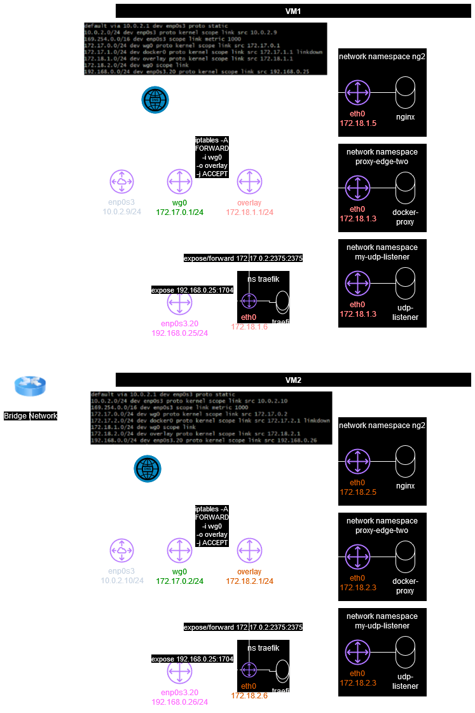


## Prerequisites

- VirtualBox 7.x.x
- Ubuntu 22.04.x ISO


## Set up nat network

1. Navigate to Tools -> Network -> NAT Network -> Create 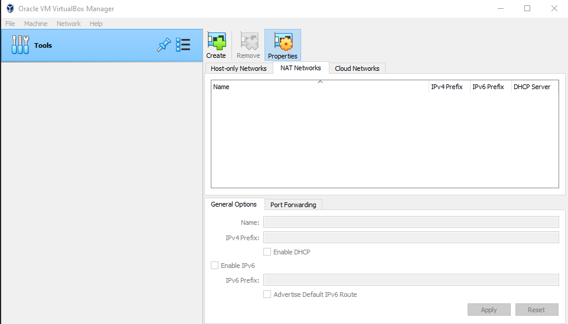
2. Select the created NatNetwork and ensure Enable DHCP option is set 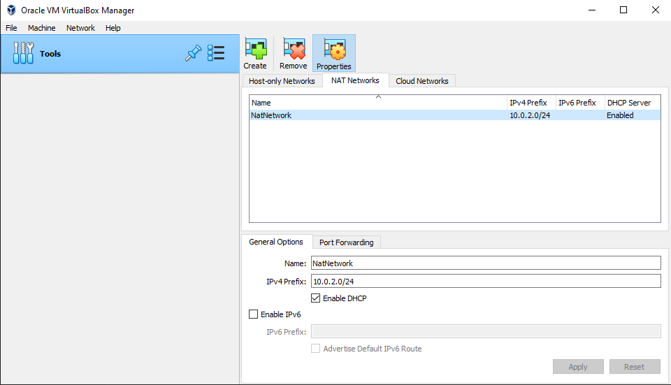


## Set up vms

We need two VMs. We are going to call them edge-one and edge-two. Below steps can be repeated to set up both VMs. The below example shows how to set up a VM called onshore. Make sure to use the respective VM name edge-one or edge-two instead.

1. Navigate to Machine -> New, enter the required information and select an image the vm should be created from 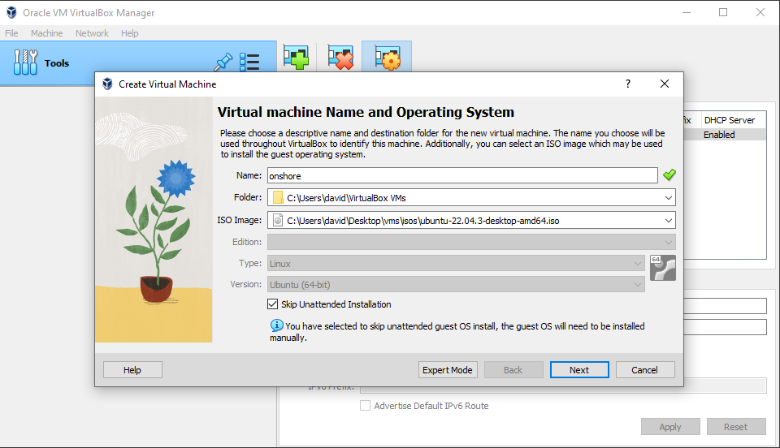
2. 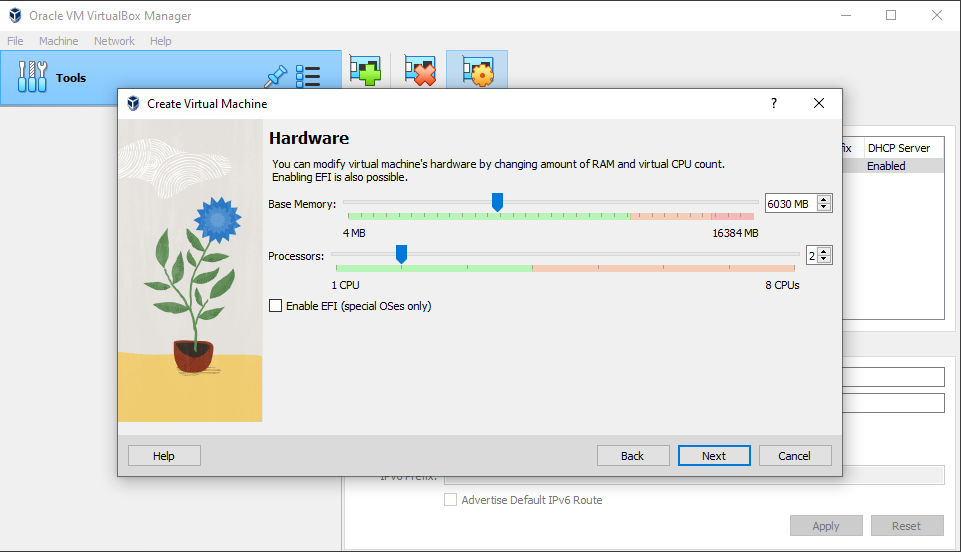
3. 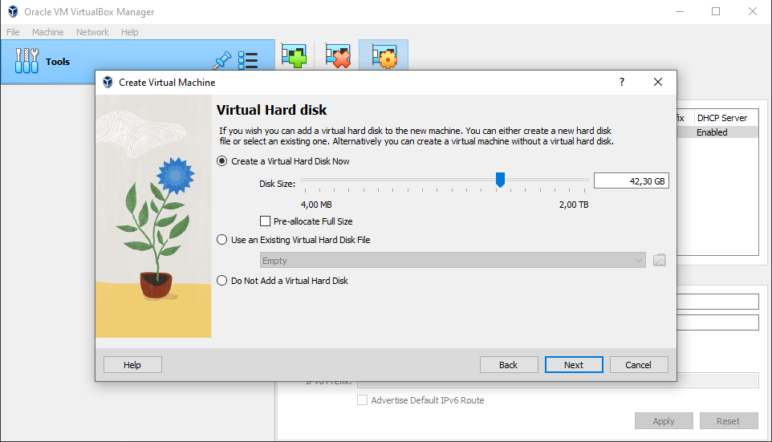
4. Finish creation 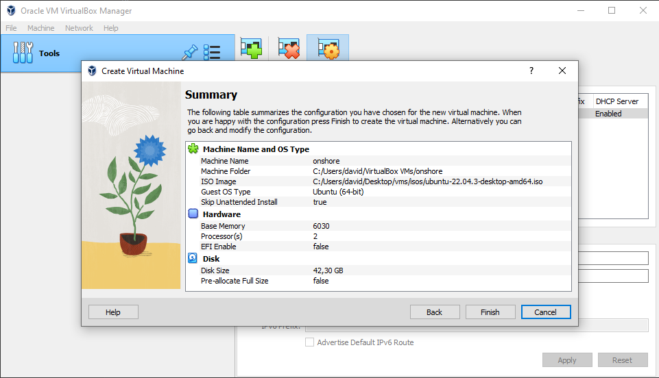
5. Right click the created vm and navigate to Settings -> Network and select the NatNetwork 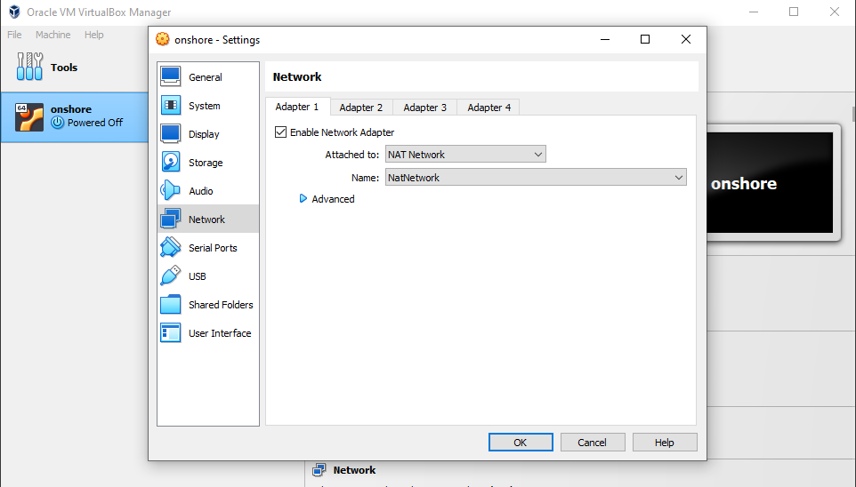
6. Start the vm and follow installation steps. Choose minimal installation 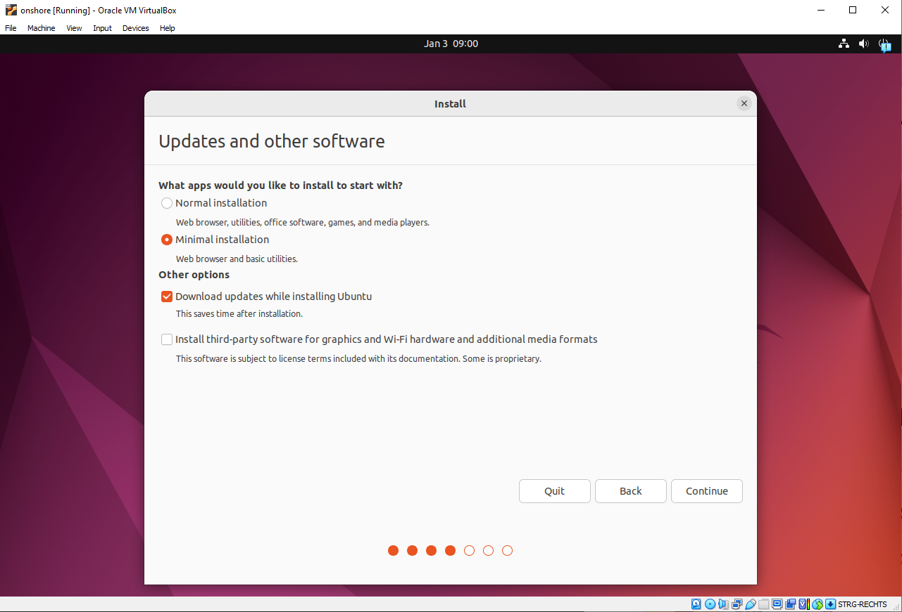
7. Use a simple user name, password and hostname 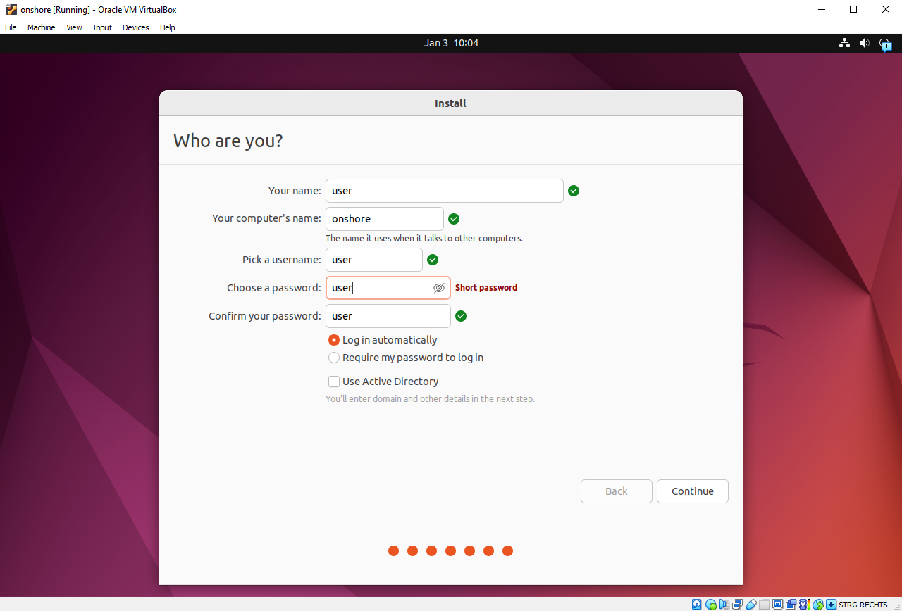

Optional ssh port forwarding:

1. Open terminal and switch to root user. Run `apt update && apt install openssh-server -y`
2. Get vm ip via ip a command, then stop vm.
3. Navigate to NatNetwork -> Port Forwarding 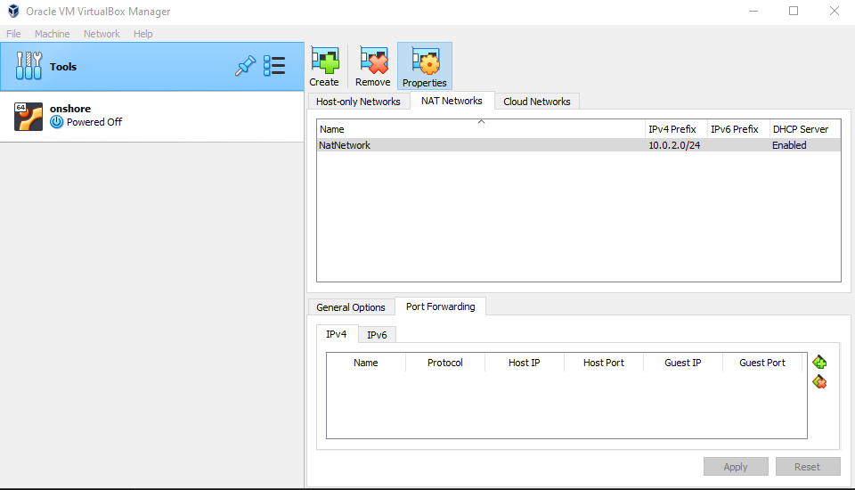
4. Add a new forwarding rule. Make sure the name and host port differ for all vms 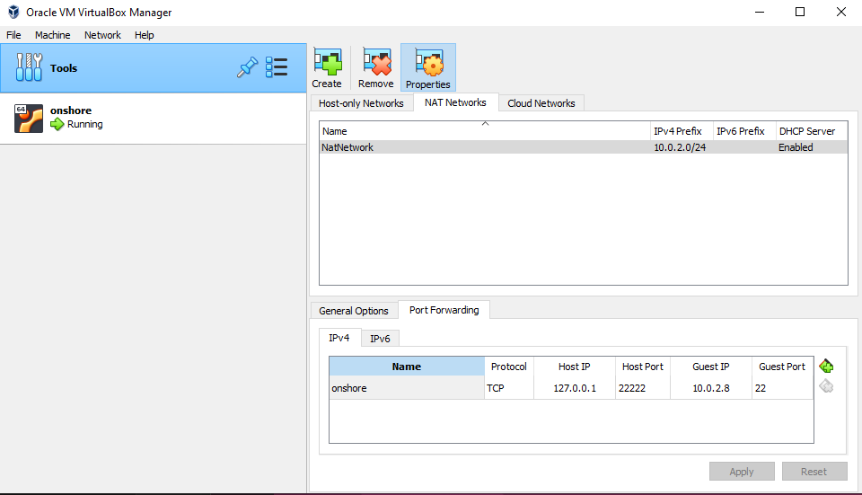


## Set up docker overlay

0. Install ngrok for remote work `curl -s https://ngrok-agent.s3.amazonaws.com/ngrok.asc | sudo tee /etc/apt/trusted.gpg.d/ngrok.asc >/dev/null && echo "deb https://ngrok-agent.s3.amazonaws.com buster main" | sudo tee /etc/apt/sources.list.d/ngrok.list && sudo apt update && sudo apt install ngrok`, `ngrok config add-authtoken <token>`
1. Set up dockers apt repository:
```
sudo apt-get update
sudo apt-get install ca-certificates curl gnupg
sudo install -m 0755 -d /etc/apt/keyrings
curl -fsSL https://download.docker.com/linux/ubuntu/gpg | sudo gpg --dearmor -o /etc/apt/keyrings/docker.gpg
sudo chmod a+r /etc/apt/keyrings/docker.gpg

echo \
  "deb [arch=$(dpkg --print-architecture) signed-by=/etc/apt/keyrings/docker.gpg] https://download.docker.com/linux/ubuntu \
  $(. /etc/os-release && echo "$VERSION_CODENAME") stable" | \
  sudo tee /etc/apt/sources.list.d/docker.list > /dev/null
sudo apt-get update

sudo apt-get install docker-ce docker-ce-cli containerd.io docker-buildx-plugin docker-compose-plugin
```
2. Create compose.yaml with docker proxy on VM edge-one. This will also create a new docker network. We do this to ensure containers can communicate via container name. Only custom docker networks use dockers inbuild DNS. The default network/bridge does not.
```
services:
  proxy:
    container_name: "proxy-edge-one"
    environment:
      - CONTAINERS=1
    image: "tecnativa/docker-socket-proxy"
    volumes:
      - /var/run/docker.sock:/var/run/docker.sock
    ports:
      - 172.17.0.1:2375:2375
    privileged: true
    networks:
      - overlay
    restart: unless-stopped

networks:
  overlay:
    name: overlay
    driver: bridge
    ipam:
      driver: default
      config:
        - subnet: 172.18.1.0/24
          gateway: 172.18.1.1
    driver_opts:
      com.docker.network.bridge.name: overlay
```
3. Create compose.yaml with docker proxy on VM edge-two. This will also create a new docker network. We do this to ensure containers can communicate via container name. Only custom docker networks use dockers inbuild DNS. The default network/bridge does not.
```
services:
  proxy:
    container_name: "proxy-edge-two"
    environment:
      - CONTAINERS=1
    image: "tecnativa/docker-socket-proxy"
    volumes:
      - /var/run/docker.sock:/var/run/docker.sock
    ports:
      - 172.17.0.2:2375:2375
    privileged: true
    networks:
      - overlay
    restart: unless-stopped

networks:
  overlay:
    name: overlay
    driver: bridge
    ipam:
      driver: default
      config:
        - subnet: 172.18.2.0/24
          gateway: 172.18.2.1
    driver_opts:
      com.docker.network.bridge.name: overlay
```
4. Create overlay network and start containers using `docker compose up -d`
5. Set up wireguard:
```
# Both vms:
apt install wireguard
umask 077
wg genkey | tee privatekey | wg pubkey > publickey
```
6. Configure wireguard /etc/wireguard/wg0.conf on VM edge-one:
```
[Interface]
Address = 172.17.0.1/24
ListenPort = 51820
PrivateKey = 4KZvPYABegksSHdiKmTaHFnpiXeO5/AQj6L7a8YjSlE=
PostUp = iptables -A FORWARD -i wg0 -o overlay -j ACCEPT
PostDown = iptables -D FORWARD -i wg0 -o overlay -j ACCEPT

[Peer]
PublicKey = Df3ptNMWulL5b4POzLyY59N+5tw59X9liDXuWEglA1Y=
AllowedIPs = 172.17.0.2/24, 172.18.2.0/24
Endpoint = 10.0.2.10:51820
PersistentKeepalive = 25
```
7. Configure wireguard /etc/wireguard/wg0.conf on VM edge-two:
```
[Interface]
Address = 172.17.0.2/24
ListenPort = 51820
PrivateKey = yMAlixuGy+KT29g8CLSNyF0sXV1ouwLLiHUCSaeFt1s=
PostUp = iptables -A FORWARD -i wg0 -o overlay -j ACCEPT
PostDown = iptables -D FORWARD -i wg0 -o overlay -j ACCEPT

[Peer]
PublicKey = 9ffGDXtrBiJRaZtZXI8m7cg4ERcG+VomDPmoP+97bTs=
AllowedIPs = 172.17.0.1/24, 172.18.1.0/24
Endpoint =  10.0.2.9:51820
PersistentKeepalive = 25
```
8. Up interfaces on both vms using `systemctl enable wg-quick@wg0.service` and `systemctl start wg-quick@wg0.service`
9. Configure network and VLANs using /etc/systemd/network/ files on VM edge-one:
```
# /etc/systemd/network/00-enp0s3.network
[Match]
Name=enp0s3

[Network]
DHCP=none
VLAN=enp0s3.20
Gateway=10.0.2.1

[Address]
Address=10.0.2.9/24
```
```
# /etc/systemd/network/10-enp0s3.20.network
[Match]
Name=enp0s3.20

[Network]
DHCP=no

[Address]
Address=192.168.0.25/24
```
```
# /etc/systemd/network/10-enp0s3.20.netdev
[NetDev]
Name=enp0s3.20
Kind=vlan

[VLAN]
Id=20
```
10. Configure network and VLANs using /etc/systemd/network/ files on VM edge-two:
```
# /etc/systemd/network/00-enp0s3.network
[Match]
Name=enp0s3

[Network]
DHCP=none
VLAN=enp0s3.20
Gateway=10.0.2.1

[Address]
Address=10.0.2.10/24
```
```
# /etc/systemd/network/10-enp0s3.20.network
[Match]
Name=enp0s3.20

[Network]
DHCP=no

[Address]
Address=192.168.0.26/24
```
```
# /etc/systemd/network/10-enp0s3.20.netdev
[NetDev]
Name=enp0s3.20
Kind=vlan

[VLAN]
Id=20
```
11. Enable and start networkd using `systemctl enable systemd-networkd.service` and `systemctl start systemd-networkd.service`
12. Ensure ip forwarding is disabled using /etc/sysctl.conf:
```
net.ipv4.ip_forward=0
```
13. `reboot`
14. Clone coreDNS and overlay plugin repositories:
```
git clone https://github.com/coredns/coredns
git clone https://github.com/davidcosc/custom-container-overlay-network.git
```
15. Adjust ./coredns/plugin.cfg by adding `dockerhosts:overlay/dockerhosts` into the plugin chain right before the `forward:forward` plugin. CoreDNS executes plugins in the order defined here. This means on incoming DNS requests the dockerhosts plugin will be queried before the forward plugin. This ensures we always check available container entries first. For an example configuration see the plugin.cfg in this repository.
16. Adjust/create ./coredns/Corefile with the following content:
```
.:53 {
	dockerhosts tcp://172.17.0.2:2375 tcp://172.17.0.1:2375
	forward . 8.8.8.8
}
```
This enables the dockerhost and forward plugin when running coreDNS with this config. The dockerhosts parameters are the docker-socket-proxy exposed ip and port for both hosts.
17. Add a replacement rule to ./coredns/go.mod to ensure the dockerhosts plugin is resolved locally `replace overlay/dockerhosts => ../custom-container-overlay-network`
18. Build and run coreDNS:
```
cd coredns
make
./coredns -conf Corefile > /dev/null &
```
19. Configure /etc/systemd/resolved.conf on VM edge-one:
```
[Resolve]
DNSStubListener=no
DNS=10.0.2.9
```
20. Configure /etc/systemd/resolved.conf on VM edge-two:
```
[Resolve]
DNSStubListener=no
DNS=10.0.2.10
```
21. `systemctl restart systemd-resolved`